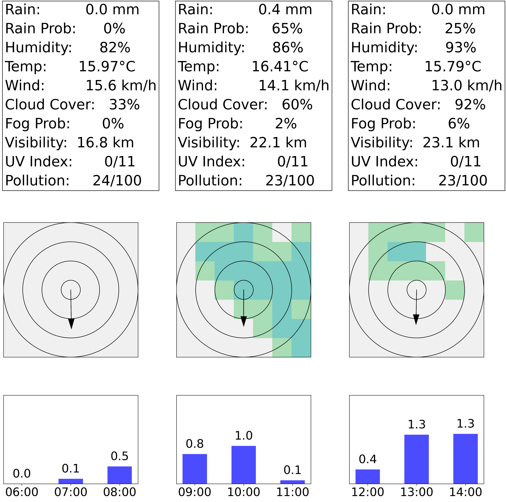

# meteoblue-cli
 
A soon-to-be command-line weather application that fetches detailed weather
forecasts from the Meteoblue API and plots a combination of hourly, 3-hourly
and daily forecasts. A 1-year free meteoblue API Key is available at
[https://content.meteoblue.com/en](https://content.meteoblue.com/en).

## Features

- Fetch current weather data using the **Meteoblue API**.
- Supports custom locations using the **OpenStreetMap Nominatim API**.
- Formats weather data into a graph overwiew
- Caches reports to for offline viewing (and saving on API usage).
- Automatically backs up weather data in a structured directory.

# Example

This is how 3-hourly rainspot and hourly precipitation data could be
structured. Based on the example of Stephenville, Texas, 24/12/2024.

## To-Do

- Integrate py plotting with main.
- Flesh out the hourly, daily, and weekly overviews
- Decide on a frontend; currently saves to png
